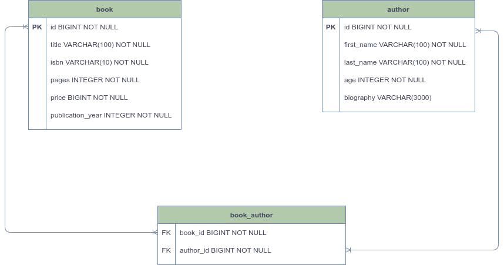
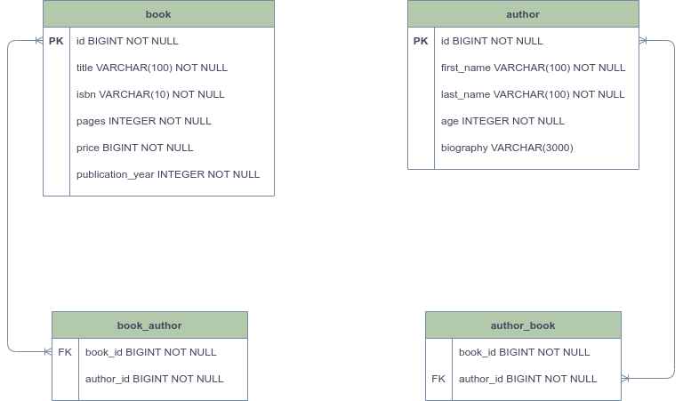

# FastAPI + SQLAlchemy DDD Example

This project is a Domain Driven Development architecture example project using Python's FastAPI framework and SQLAlchemy ORM.

<br />

## How to run

The requirements for this project are:

* Python 3.9 or higher
* PostgresSQL 11 or higher

```shell
$ poetry install
```

This project uses Poetry to manage dependencies. Therefore, it is recommended to use the ```poetry``` command, and you can proceed with the dependency installation to run this application with the above command.

```shell
$ poetry export -f requirements.txt --output requirements.txt 
```

If you want to install with the default Python package manager such as ```pip``` or ```pipx```, use the above command to extract the requirements.txt file.

```shell
$ pip install -r requirements.txt
```

Then you can proceed with the dependency installation with the default ```pip```(Python package manager).

```shell
$ uvicorn app:app --host=0.0.0.0 --loop=uvloop
```

This project is implemented as an asynchronous function. Therefore, it is recommended to run the server using the ```uvicorn``` command.

<br />

## ERD

This project uses **PostgresSQL**. A project that manages books using two domains, Book and Author, was used as an example to implement DDD in Python.



One person can write multiple books, and a book can contain multiple authors.

-> ***However, many to many designs in DDD are not good designs.***

<br />

The purpose of DDD is to define requirements as domains and simplify them. However, in the real world, the many-to-many relationship is very common as shown above. Modeling the real world as it is makes **implementation and maintenance more complicated**, and the characteristics of the domain are irrelevant. Rather, it causes **difficulty in understanding the domain**.



Therefore, it is important to move away from Many-to-Many as possible as in the above ERD, and constrain the possible relationships through a one-way form of One-To-Many.

<br />

## SQLAlchemy classical mapping

SQLAlchemy is a Python ORM library. The classic mapping provided by this library is a method that is very compatible with DDD, and we can persist and import the domain model to the DB without implementing a separate Mapper.

```python
from abc import abstractmethod
from typing import Protocol

from . import D, P


class ModelMapper(Protocol[D, P]):
    @staticmethod
    @abstractmethod
    def map_to_domain_entity(model: P) -> D:
        ...

    @staticmethod
    @abstractmethod
    def map_to_persistence_entity(model: D) -> P:
        ...
```

In general, if we persist in DB using ORM, we separate ORM model (Entity model) and Domain model. Then, we need to implement Mapper that converts ORM model that is called when persisting or importing to DB into domain model. <br /> (***Otherwise, it becomes an ORM-dependent model, and the domain model becomes a repository-related concern model***)

In this project, we implemented both the mapper that is commonly used and the mapper that is used in SQLAlchemy to understand the example

```python
def start_mapper():
    t = BookEntity.__table__
    rt = BookAuthorEntity.__table__

    mapper_registry.map_imperatively(Book, t, properties={
        'authors': relationship(BookAuthor, backref=backref("book"), lazy='joined')
    })
    mapper_registry.map_imperatively(BookAuthor, rt, properties={
        'books': relationship(Book, backref=backref("author", cascade="all, delete-orphan"), lazy='joined')
    })
```

However, if you use ```mapper_registry``` provided by SQLAlchemy, it returns the domain model without a separate mapper implementation or method call.

To use the Classical Mapper, the code defined as ```Table``` is required. If you want to use it together with the ORM model, implement the ORM model and then easily convert it into a table form using the ```__table__``` magic method. can be called up.

Note: (https://docs.sqlalchemy.org/en/14/orm/mapping_api.html#sqlalchemy.orm.registry.map_imperatively)

<br />

## Snowflake Identifier

An identifier is a number for identifying a given domain. Usually we will use auto increment or UUID provided by the database for these identifiers. This is not to say that this method is wrong.

However, since it is domain-driven development, it is recommended to be assigned an identifier when a domain is created as much as possible. In order to give an identifier at the time the domain is created, I chose to create it myself.

[Snowflake ID](https://en.wikipedia.org/wiki/Snowflake_ID) was developed by Twitter in 2010 and works based on timestamp.

<br />

## Event Processing

How can we solve the problem if, when the logic in one domain is executed, the requirement affects other domains as well as that domain?

​    -> What if, when there are Book and Author domains, the book written by the author should appear even if the author is searched, and the author who wrote the book should appear when the book is searched?

We used a one-to-many structure, not Many-to-Many, and when registering a book and adding an author, the book must also be added to the author's information. 


```python
class Book:
    id: BookId
    title: Title
    isbn: Isbn
    pages: Page
    price: KoreanMoney
    publication_year: Year
    authors: List[BookAuthor] = field(default_factory=list)

    def add_author(self, command: AddAuthorCommand):
        self.authors.append(BookAuthor(book_id=self.id, author_id=command.author_id))
```

```python
class Author:
    id: AuthorId
    name: Name
    age: Age
    biography: Optional[Biography]
    book_ids: List[AuthorBook] = field(default_factory=list)

    def add_book(self, command: AddBookToAuthorCommand):
        self.book_ids.append(AuthorBook(author_id=self.id, book_id=command.book_id))
```

In this situation, we need to consider 3 things.

1. What if the transaction was successful in ```Book``` domain, but failed in ```Author``` domain?

2. What if the transaction processing time of Author domain becomes long?

3. Two domain objects are changed. If so, which useCase should the useCase go into?
   (*If two domains are combined in one service logic*)

Question 3 is a very **worrying**. Book is a domain object representing a book, and if the logic to add a book in the Author domain is to add a book or an author, the distinction becomes ambiguous.

This problem is the high coupling problem between the book and the so-called **BOUNDED CONTEXT** that the author is very close to. To solve this problem, there is a way to use **events**. Something happened (**changed state**) in the past. The context is that it happens and does this.


In the domain model, event subjects are domain objects, which can be implemented in a way that executes domain logic to raise related events when the state changes.

The Event Handler responds to the event that the Event Delegator encounters in the service logic, and can use the data contained in the event to perform the desired function. The data contained in these events includes the following information.

- Event type: Expressed as a class name (Pydantic BaseModel or Python dataclass)
- Additional data: Data associated with a domain whose state has changed

```python
from pydantic import BaseModel


class AuthorAddedToBookDomainEvent(BaseModel):
    book_id: int
    author_id: int
```

When naming event class names, it is recommended to use the past tense such as *Changed*, *Added*. This is because even if the event was made on a current basis, it is caused by a state change that occurred in the past.

By using events, we avoid mixing up logic from different domains, and this is an excellent monolithic development approach that in the future can go into favorable conditions for migrating to microservices architectures (MSA).

<br />

## Unit Of Work and Repository

The repository pattern (Repository) is an abstraction of persistent storage (DB). In Python, to abstract classes, ```ABC``` or [Duck typing](https://en.wikipedia.org/wiki/Duck_typing) However, when using the storage pattern, you are putting the rules of implementation, not inheritance. In this case, Python's ```Protocol``` is more useful.

```python
from abc import abstractmethod
from typing import Protocol

from modules.book.infrastructure.query.dto import BookDTO


class BookQueryRepository(Protocol):
    @abstractmethod
    async def fetch_by_title(self, title: str) -> BookDTO:
        ...

    @abstractmethod
    async def fetch_by_id(self, _id: int) -> BookDTO:
        ...
```

The most essential part of DDD is that the domain model and its associated repositories should not depend directly on it. Therefore, it should be implemented in a form that can be moved easily and remove the dependency of a specific library by abstracting it using the storage pattern.

In addition, the Repository pattern is very common in the DDD world. Even developers who have moved from Java or C# to Python can easily recognize this pattern.

A pattern similar to the storage pattern is the Active Record pattern. The Active Record pattern is implemented by putting logic in the ORM model(Storage model), making it very simple to separate the domain model and persistence. This pattern is common in Flask-SQLAlchemy.

Note: (https://calpaterson.com/activerecord.html)

However, the more complex the domain, the more inconvenient when used in DDD in that it is difficult to change the model or code. In the storage pattern, you can easily change the persistence logic that increases according to the complexity of the domain, but the Active Record pattern is centered on changing the domain model, so there are some limitations in changing the complex logic.

```python
from pymfdata.rdb.connection import AsyncEngine
from pymfdata.rdb.usecase import AsyncSQLAlchemyUnitOfWork

from persistence.book.repository import BookRepository


class BookPersistenceUnitOfWork(AsyncSQLAlchemyUnitOfWork):
    def __init__(self, engine: AsyncEngine) -> None:
        super().__init__(engine)

    async def __aenter__(self) -> None:
        await super().__aenter__()

        self.repository = BookRepository(self.session)
```

The Unit Of Work contains the necessary data for us to use the DB through the storage pattern. In the case of SQLAlchemy, there is a ```session``` allocated from a connection.

Note: (https://github.com/NEONKID/python-mf-data/blob/main/pymfdata/common/usecase.py)

Since these are all infrastructure resources, they must be returned after use. SQLAlchemy does not do this for you automatically. However, by default, SQLAlchemy uses the Unit Of Work pattern, and most of the functions provided by default are managed in units of API requests(threads or tasks).

Note: (https://docs.sqlalchemy.org/en/14/orm/contextual.html)

If transactions in multiple domains occur in one domain service logic, they should be independent of each other, but if used as a default value, transactions in multiple domains occur at once in one session, which is also in one domain persistence logic. It would be in the same vein that both would be executed. Therefore, it is recommended to apply units of work on a per-domain basis so that their resources are available.

<br />

## Command and Query (CQRS)

To implement book lookup and author lookup functions in this project, we need to pull data from multiple aggregates. We need to get the author information from the Book domain, and we need to get the book information from Author.

***-> If you need to fetch data from multiple aggregates, how should you handle it?***

<br />

The reason for this concern is that it uses a single domain model when changing and querying the state of the system.

```python
class BookPersistenceAdapter(BaseUseCase[BookPersistenceUnitOfWork], PersistenceAdapter[Book, BookId]):
    def __init__(self, uow: BookPersistenceUnitOfWork) -> None:
        self._uow = uow

    @async_transactional(read_only=True)
    async def find_by_id(self, _id: BookId) -> Book:
        return await self.uow.repository.find_by_pk(_id)
```

To persist the Book domain, we first check whether the corresponding domain object exists or not, and the form of the returned value is the domain model Book. The ORM technique, which is mainly used when implementing a domain model in object-oriented way, is suitable for implementing state change of a domain, but on the contrary, it is not suitable for implementing the function of fetching and outputting data from multiple aggregates.

A way to lower the implementation complexity is CQRS, which separates Command and Query.


(***Command is a function to change the state, and Query is a function to get state information from the user's point of view.***)

Note: (https://martinfowler.com/bliki/CQRS.html)

CQRS is suitable for complex domains. The more complex the domain, the greater the difference in the range of data covered by the command and query functions. The reason is that the model implementation becomes more complex than we need to look up.

In the example we are dealing with now, there is not much difference because we simply deal with ```Book``` and ```Author```. However, in the case of a content management system such as CMS or commerce, data from other aggregates such as order-product-buyer are required, and in the case of CMS, content Because it also requires data from other aggregates in the form of post-category-tags, model implementation becomes more complex than necessary for optimized loading implementations such as eager loading and fetch.

```python
from dataclasses import dataclass
from sqlalchemy.ext.associationproxy import association_proxy
from typing import FrozenSet


@dataclass
class BookDTO:
    id: int
    title: str
    isbn: str
    pages: int
    authors: FrozenSet[int] = association_proxy("book_authors", "author_id")
```

Therefore, by having the read model (DTO) implemented separately, the query function can be easily implemented without modifying the domain model for state change for querying through the implementation of a separate query model for UI.

Since the inquiry model is used for simply reading and inquiring data, there is no problem even if the application logic (UseCase) class is not implemented separately like the persistence process, and implemented directly in the Router or Controller. However, if you need some more logic in the process of expressing data, you can implement a separate application logic (UseCase) class.

<br />

## DI (Dependency Injection)

Explicit dependency injection is a means to make testing easier in DDD.

In FastAPI, ```Depends``` acts as dependency injection. However, this is Python's standard way of importing, which is **implicit (implicit) dependency injection**. 

Of course, you can also do a Monkey Patch to change something for testing in implicit dependency injection. However, this requires calling ```mock.patch``` on every test and using numerous mocks to avoid unwanted side effects.

Then there is a way to write explicit dependencies, which makes the application more complex. (Adding containers, etc., managing dependencies, etc.)

I thought it wouldn't be a bad idea to use this method if it could make it easier to write test code in return, and if you need to implement multiple applications based on domain logic (e.g. admin API, user API, etc), then using containers to manage dependencies is a good idea. Rather, it would be advantageous.

If you feel there is a limit to implementing all of this with care, you can try using the Dependency Injector library.

```python
from dependency_injector.containers import DeclarativeContainer
from dependency_injector.providers import Factory, Singleton


class Container(DeclarativeContainer):
    ...
```

By providing various injection methods such as Singleton and Factory for dependency, creating a container when the application is running, and then using the ```Depends``` provided by FastAPI together, you can import the dependencies together when the api is called.

A container configured in this way can easily mock and implement dependencies through ```override``` when writing test code.

```python
import pytest
from unittest.mock import AsyncMock

_use_case_mock = AsyncMock(spec=AddBookToAuthorUseCase)

        
@pytest.mark.asyncio
async def test_example():
    _use_case_mock.invoke.return_value = ...

    with api.container.add_book_to_author_use_case.override(_use_case_mock):
        ...

    _use_case_mock.invoke.assert_called_once_with(...)
```

PEP 20 states the statement **Explicit is better than implicit**. Therefore, if you are implementing DDD like Python, explicit dependency injection with a style that relies on abstract rather than concrete would be more appropriate.


